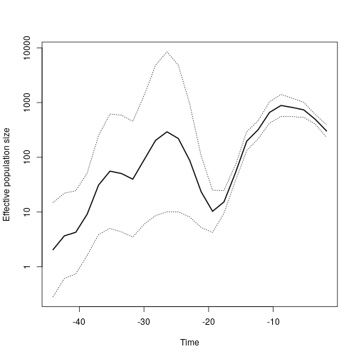
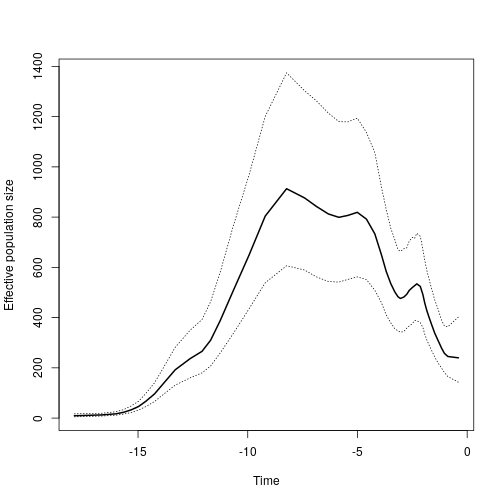
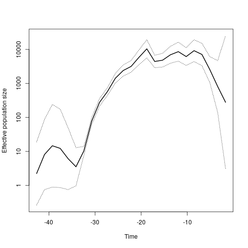
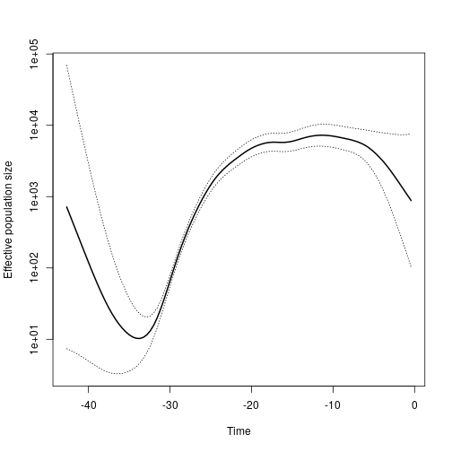
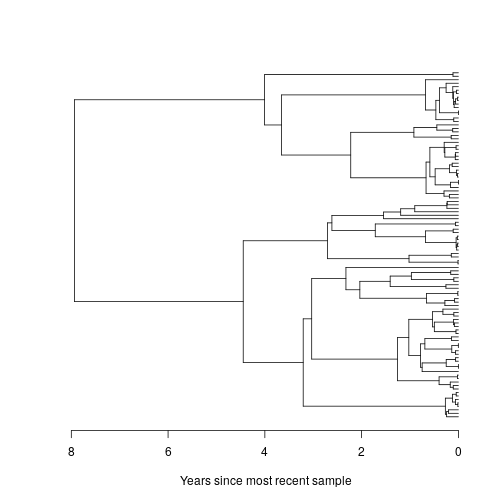
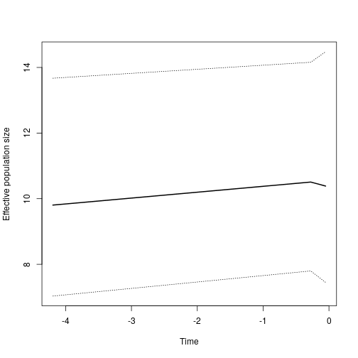

# mlesky : Maximum likelihood inference of effective population size through time using GMRF-skygrid approach

This package is related to previous Bayesian implementations of the Bayesian skygrid model with the following notable differences: 

* The GMRF process takes place on the 2nd-order difference of log(Ne), which is more similar to the `skygrowth` model of Volz & Didelot 
* When computing the GMRF likelihood, the smoothing parameter (ie the precision of random walk) is fixed
* We use a novel cross-validation approach for selecting the smoothing parameter 

## Installation

In R, install the `devtools` package and run 
```
devtools::install_github('emvolz-phylodynamics/mleksy')
```

## Roadmap 

* Add non-parametric bootstrap as alternative for CI
* Add regression models for non-genetic time-series 
* Parameter to select order of differencing in GMRF 

## MRSA example 

Here we reanalyze dated phylogenies from __Volz & Didelot, Systematic Biology 2018__. 


```r
require(mlesky)

# load the tree
tree <- ape::read.tree(system.file('mrsa.nwk', package = 'mlesky'))

# run mleksy with defaults
(fit <- mlskygrid( tree ))
```


```
## mlskygrid fit
## 	Smoothing parameter tau = 1 
## 
## Estimated Ne(t): 
##    Time before most recent sample      2.5%       MLE      97.5%
## 1                     -30.4096228  11.08778  18.27892   30.13398
## 2                     -16.2298479  10.28541  16.50235   26.47708
## 3                     -15.3823126  18.27050  28.47050   44.36492
## 4                     -14.6793682  40.66693  62.93026   97.38177
## 5                     -13.8832420  79.16442 125.17853  197.93822
## 6                     -12.7817939 165.94620 260.38328  408.56287
## 7                     -11.7342269 162.61601 263.23885  426.12467
## 8                     -10.6065988 349.41928 551.58375  870.71507
## 9                      -8.9697100 543.46744 868.60313 1388.25501
## 10                     -7.4925180 507.18359 823.79000 1338.03612
## 11                     -6.3244250 528.39495 833.76254 1315.60676
## 12                     -5.3633933 494.12966 781.22088 1235.11318
## 13                     -4.5223621 554.40120 850.39309 1304.41351
## 14                     -3.8627705 377.35832 579.64194  890.36005
## 15                     -3.4613323 332.78727 499.58719  749.99070
## 16                     -3.1420674 307.96903 461.84831  692.61465
## 17                     -2.8790880 327.29503 486.50151  723.15098
## 18                     -2.5960394 372.77824 548.80579  807.95434
## 19                     -2.3414903 357.42964 527.04631  777.15381
## 20                     -2.1145133 358.11831 526.24942  773.31552
## 21                     -1.8966209 300.94954 442.88321  651.75558
## 22                     -1.6801600 272.19821 398.73636  584.09894
## 23                     -1.3950416 218.53722 325.23011  484.01193
## 24                     -1.1047243 167.21868 251.54252  378.38859
## 25                     -0.4887206 149.39511 241.20121  389.42391
```

```r
plot ( fit , logy = FALSE )
```



Note there's a lot of uncertainty >20 years in the past when there are very few lineages remaining in the tree. We can focus the analysis on the portion of the tree that is more informative using the `NeStartTimeBeforePresent` parameter. 
We also us cross-validation to optimize the smoothing parameter: 

```r
(
fit <- mlskygrid( tree
  , tau = NULL, tau_lower = 1, tau_upper = 20
  , ncpu = 6
  , res = 50
  , NeStartTimeBeforePresent = 20)
)
```


```
## mlskygrid fit
## 	Smoothing parameter tau = 12.6551020063652 
## 
## Estimated Ne(t): 
##    Time before most recent sample       2.5%        MLE      97.5%
## 1                     -17.8997908   5.104185   9.293844   16.92249
## 2                     -16.6452483   8.256975  12.629003   19.31600
## 3                     -16.0039543  11.451250  16.957466   25.11129
...
## 49                     -0.8810516 165.254848 245.208756  363.84611
## 50                     -0.3999231 143.033613 239.861071  402.23646
```

```r
plot( fit , logy=FALSE)
```




## HIV example 

We analyzed 399 HIV-1 sequences from Senegal between 1990 and 2014. 
All sequences are subtype CRF02_AG. `treedater` analysis shows a common ancestor around 1970 with LTT having rapid change in the early 1980s when the HIV epidemic was expanding. 

Here is the `mlesky` analysis 


```r
require(mlesky)

# load the tree 
tree <- ape::read.tree( system.file('sn02ag2.0.nwk', package='mlesky') )

# mlesky with default parameters
(fit <- mlskygrid( tree ))
```


```
## mlskygrid fit
## 	Smoothing parameter tau = 1 
## 
## Estimated Ne(t): 
##    Time before most recent sample        2.5%         MLE        97.5%
## 1                      -37.130693    1.979676    3.334801     5.617532
## 2                      -31.306300    6.182592    9.111457    13.427806
## 3                      -30.810292   15.157650   22.697609    33.988216
## 4                      -30.302840   37.264933   55.015245    81.220519
## 5                      -29.844931   46.091389   69.212620   103.932359
## 6                      -29.475877   63.179454   92.964742   136.791992
## 7                      -29.052232   98.962703  146.720819   217.526381
## 8                      -28.566624  152.183579  226.272673   336.431321
## 9                      -28.089652  181.543883  273.240477   411.252405
## 10                     -27.644176  233.673102  349.059459   521.422898
## 11                     -27.151933  298.813717  447.493288   670.150770
## 12                     -26.626158  373.891480  557.695422   831.856837
## 13                     -26.116216  396.175449  591.161183   882.113078
## 14                     -25.652766  445.106766  665.617763   995.372436
## 15                     -25.159815  632.960239  964.013686  1468.216056
## 16                     -24.279981 1399.530063 2128.566753  3237.369844
## 17                     -23.082810 1733.928515 2712.802100  4244.289872
## 18                     -21.924229 1845.711102 2872.388191  4470.154571
## 19                     -20.671882 2484.580136 3902.417026  6129.348947
## 20                     -18.720696 4716.340401 7378.554473 11543.498027
## 21                     -16.473246 3683.080367 5681.577004  8764.488970
## 22                     -15.097059 1953.415741 3132.431967  5023.062847
## 23                     -13.332052 4101.392527 6340.765587  9802.843295
## 24                     -10.287495 4654.617588 7441.651215 11897.469935
## 25                      -4.302552 3837.840700 6248.041907 10171.872861
```

```r
plot( fit, logy=FALSE)
```



Now we use cross-validation to find the smoothing parameter: 


```r
( fit <- mlskygrid( tree , tau = NULL, tau_lower = .1, tau_upper = 20 , ncpu = 6) )
```


```
## mlskygrid fit
## 	Smoothing parameter tau = 8.09992733999835 
## 
## Estimated Ne(t): 
##    Time before most recent sample        2.5%         MLE       97.5%
## 1                      -37.130693    2.236983    3.599090     5.79059
## 2                      -31.306300    6.802354    9.320319    12.77034
## 3                      -30.810292   16.612224   22.320891    29.99130
## 4                      -30.302840   35.029097   47.266478    63.77898
## 5                      -29.844931   53.368510   71.641728    96.17164
## 6                      -29.475877   75.969433  102.949718   139.51196
## 7                      -29.052232  111.322325  150.047639   202.24420
## 8                      -28.566624  158.131208  214.056399   289.76027
## 9                      -28.089652  205.669317  278.082745   375.99198
## 10                     -27.644176  260.312285  353.386855   479.74021
## 11                     -27.151933  323.452187  437.602445   592.03773
## 12                     -26.626158  386.696338  522.957059   707.23216
## 13                     -26.116216  444.061140  603.241409   819.48220
## 14                     -25.652766  547.130845  750.444550  1029.30958
## 15                     -25.159815  793.012908 1091.825335  1503.23223
## 16                     -24.279981 1336.413945 1849.729567  2560.20935
## 17                     -23.082810 1822.428792 2559.202596  3593.84024
## 18                     -21.924229 2204.215413 3146.748191  4492.31237
## 19                     -20.671882 2974.584033 4267.232032  6121.61869
## 20                     -18.720696 4416.682195 6275.870099  8917.67706
## 21                     -16.473246 3818.858459 5478.929731  7860.63985
## 22                     -15.097059 3256.151102 4695.996798  6772.53151
## 23                     -13.332052 4046.747661 5850.008920  8456.81699
## 24                     -10.287495 4737.475817 6969.907755 10254.32445
## 25                      -4.302552 4011.258062 6453.941907 10384.11528
```

```r
plot(fit, logy=FALSE) 
```




## Constant Ne(t)

Skyline, skyride and skygrid models have a tendency to erroneously identify exponential growth in situations where the size is constant. 
We can ameliorate that error by selecting a smaller time-axis resolution and adapting the Ne time axis to periods where the phylogeny contains a lot of information (default parameter `adapt_time_axis=TRUE`).
This shows the use of a function to optimize the `res` parameter (number of Ne change points) using AIC

Simulate the tree with constant Ne: 

```r
library(ape)
set.seed(0)
tree=rcoal(100)
tree$edge.length=tree$edge.length*10
plot(tree, show.tip.label = F)
axisPhylo(backward = T)
mtext("Years since most recent sample", side=1, line=3)
```



Find the best `res`:

```r
(resx = optim_res_aic( tree , ncpu = 8))
```

```
## [1] 3
```
Note that this tests multiple `res` values and can quickened using multi-core processing. The `ncpu` parameter should be chosen for your system. 

Estimate Ne(t):

```r
(fit <- mlskygrid( tree, res = resx))
```

```
##  Estimating Ne(t)...
## initial  value -310.127009 
## final  value -324.668111 
## converged
```

```
## mlskygrid fit
## 	Smoothing parameter tau = 1 
## 
## Estimated Ne(t): 
##   Time before most recent sample     2.5%       MLE    97.5%
## 1                    -4.19397409 7.032216  9.805286 13.67188
## 2                    -0.27698306 7.797629 10.506989 14.15774
## 3                    -0.05097893 7.447767 10.384675 14.47971
```

```r
plot( fit , logy=FALSE)
```


