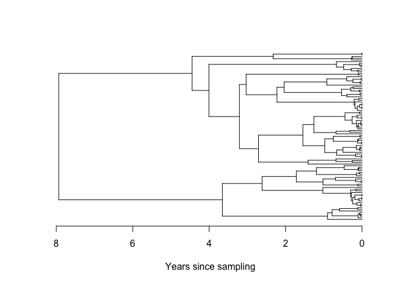

<!-- README.md is generated from README.Rmd. Please edit that file -->

# mlesky : Maximum likelihood inference of effective population size through time using GMRF-skygrid approach

This package is related to previous Bayesian implementations of the
Bayesian skygrid model with the following notable differences:

  - The GMRF process takes place on the 2nd-order difference of log(Ne),
    which is more similar to the `skygrowth` model of Volz & Didelot
  - When computing the GMRF likelihood, the smoothing parameter (ie the
    precision of random walk) is fixed
  - We use a novel cross-validation approach for selecting the smoothing
    parameter

## Installation

In R, install the `devtools` package and run

    devtools::install_github('emvolz-phylodynamics/mleksy')

## Roadmap

  - Add non-parametric bootstrap as alternative for CI
  - Add regression models for non-genetic time-series
  - Parameter to select order of differencing in GMRF

## MRSA example

Here we reanalyze dated phylogenies from **Volz & Didelot, Systematic
Biology 2018**.

``` r
require(mlesky)
#> Loading required package: mlesky

# load the tree
tree <- ape::read.tree(system.file('mrsa.nwk', package = 'mlesky'))

# run mleksy with defaults
(fit <- mlsky( tree ))
#>  Estimating Ne(t)...
#> mlskygrid fit
#>  Smoothing parameter tau = 1 
#> 
#> Estimated Ne(t): 
#>    Time before most recent sample      2.5%       MLE      97.5%
#> 1                     -30.4096228  11.08834  18.28014   30.13647
#> 2                     -16.2298479  10.28534  16.50220   26.47676
#> 3                     -15.3823126  18.26884  28.46743   44.35940
#> 4                     -14.6793682  40.66706  62.93050   97.38219
#> 5                     -13.8832420  79.17148 125.19191  197.96287
#> 6                     -12.7817939 165.94433 260.37997  408.55707
#> 7                     -11.7342269 162.62114 263.24921  426.14474
#> 8                     -10.6065988 349.46830 551.67943  870.89502
#> 9                      -8.9697100 543.55290 868.77326 1388.58053
#> 10                     -7.4925180 507.19814 823.81960 1338.09387
#> 11                     -6.3244250 528.36948 833.71289 1315.51350
#> 12                     -5.3633933 494.06890 781.10555 1234.90041
#> 13                     -4.5223621 554.39079 850.37371 1304.37852
#> 14                     -3.8627705 377.37994 579.67998  890.42591
#> 15                     -3.4613323 332.78868 499.59096  749.99886
#> 16                     -3.1420674 307.99728 461.89448  692.68959
#> 17                     -2.8790880 327.25363 486.43325  723.03952
#> 18                     -2.5960394 372.77214 548.79426  807.93360
#> 19                     -2.3414903 357.42740 527.04194  777.14581
#> 20                     -2.1145133 358.10540 526.22848  773.28187
#> 21                     -1.8966209 300.96097 442.90253  651.78765
#> 22                     -1.6801600 272.22601 398.78247  584.17437
#> 23                     -1.3950416 218.53815 325.23309  484.01876
#> 24                     -1.1047243 167.23670 251.57307  378.43972
#> 25                     -0.4887206 149.39797 241.20749  389.43670
plot ( fit , logy = FALSE )
```

<!-- -->

Note there’s a lot of uncertainty \>20 years in the past when there are
very few lineages remaining in the tree. We can focus the analysis on
the portion of the tree that is more informative using the
`NeStartTimeBeforePresent` parameter. We also us cross-validation to
optimize the smoothing parameter:

``` r
(
fit <- mlsky( tree
  , tau = NULL, tau_lower = 1, tau_upper = 20
  , ncpu = 6
  , res = 50
  , NeStartTimeBeforePresent = 20)
)
#> Precision parameter *tau* not provided. Computing now....
#> Precision parameter tau =  12.5094881723107 
#>  Estimating Ne(t)...
#> mlskygrid fit
#>  Smoothing parameter tau = 12.5094881723107 
#> 
#> Estimated Ne(t): 
#>    Time before most recent sample       2.5%        MLE      97.5%
#> 1                     -17.8997908   5.101370   9.294728   16.93505
#> 2                     -16.6452483   8.254923  12.630972   19.32682
#> 3                     -16.0039543  11.444051  16.956746   25.12495
#> 4                     -15.6509852  15.943616  23.196995   33.75022
#> 5                     -15.3155548  22.077637  32.625062   48.21144
#> 6                     -14.9759929  31.811285  46.134951   66.90813
#> 7                     -14.6498120  45.426774  66.569572   97.55278
#> 8                     -14.2477104  65.833693  96.253707  140.73001
#> 9                     -13.8374887  94.807960 138.241331  201.57237
#> 10                    -13.3040682 131.280053 192.563550  282.45510
#> 11                    -12.6272780 160.059021 236.699121  350.03634
#> 12                    -12.0821939 179.872281 265.736560  392.58922
#> 13                    -11.6903544 207.246569 309.910978  463.43259
#> 14                    -11.2564688 258.655056 387.472581  580.44487
#> 15                    -10.6438839 338.485626 510.407125  769.64992
#> 16                     -9.9398524 434.856142 649.097829  968.89052
#> 17                     -9.2038373 538.320034 804.409783 1202.02678
#> 18                     -8.2305549 606.374419 913.507934 1376.20704
#> 19                     -7.4103726 588.926830 876.280990 1303.84342
#> 20                     -6.8726925 561.666611 842.382473 1263.39757
#> 21                     -6.3270879 543.354247 812.331131 1214.45976
#> 22                     -5.8485709 540.709575 798.925569 1180.45268
#> 23                     -5.4436566 551.512254 806.562544 1179.56244
#> 24                     -5.0071410 561.841592 819.383694 1194.98031
#> 25                     -4.5901175 551.556561 792.370384 1138.32537
#> 26                     -4.2081914 508.637249 733.417211 1057.53325
#> 27                     -3.9063580 458.929677 649.736887  919.87519
#> 28                     -3.6893199 409.993732 583.651595  830.86437
#> 29                     -3.4814139 378.804683 534.978105  755.53863
#> 30                     -3.2974129 354.787767 501.926110  710.08598
#> 31                     -3.1538892 347.411345 482.737139  670.77587
#> 32                     -3.0443989 341.410813 476.010052  663.67426
#> 33                     -2.8884619 344.087779 481.536155  673.88929
#> 34                     -2.7562315 357.770859 492.365486  677.59507
#> 35                     -2.6432252 366.166444 507.880782  704.44164
#> 36                     -2.4986947 375.544386 519.832872  719.55866
#> 37                     -2.3991185 388.102470 526.929086  715.41483
#> 38                     -2.2955852 387.919166 534.457488  736.35136
#> 39                     -2.1355302 379.325831 524.177974  724.34442
#> 40                     -2.0177824 360.188018 491.446262  670.53710
#> 41                     -1.9355483 334.091818 458.778750  630.00029
#> 42                     -1.8416864 311.629508 428.487560  589.16625
#> 43                     -1.7341182 289.839104 400.228511  552.66132
#> 44                     -1.6116516 267.632583 369.896724  511.23666
#> 45                     -1.4808802 243.182511 338.514982  471.21971
#> 46                     -1.3180756 218.385534 307.199312  432.13218
#> 47                     -1.1688388 199.196177 278.701375  389.93949
#> 48                     -1.0374259 181.214952 257.691070  366.44155
#> 49                     -0.8810516 165.231077 245.248162  364.01543
#> 50                     -0.3999231 143.067467 240.045944  402.76141

plot( fit , logy=FALSE)
```

<!-- -->

## HIV example

We analyzed 399 HIV-1 sequences from Senegal between 1990 and 2014. All
sequences are subtype CRF02\_AG. `treedater` analysis shows a common
ancestor around 1970 with LTT having rapid change in the early 1980s
when the HIV epidemic was expanding.

Here is the `mlesky` analysis

``` r
require(mlesky)

# load the tree 
tree <- ape::read.tree( system.file('sn02ag2.0.nwk', package='mlesky') )

# mlesky with default parameters
(fit <- mlsky( tree ))
#>  Estimating Ne(t)...
#> mlskygrid fit
#>  Smoothing parameter tau = 1 
#> 
#> Estimated Ne(t): 
#>    Time before most recent sample        2.5%         MLE        97.5%
#> 1                      -37.130693    1.979812    3.335103     5.618164
#> 2                      -31.306300    6.182960    9.112097    13.428894
#> 3                      -30.810292   15.157779   22.697846    33.988635
#> 4                      -30.302840   37.264129   55.013835    81.218108
#> 5                      -29.844931   46.089158   69.208867   103.926117
#> 6                      -29.475877   63.181671   92.968434   136.798055
#> 7                      -29.052232   98.963412  146.722193   217.528899
#> 8                      -28.566624  152.191424  226.286219   336.454261
#> 9                      -28.089652  181.543449  273.240013   411.251991
#> 10                     -27.644176  233.677119  349.066024   521.433549
#> 11                     -27.151933  298.789845  447.452023   670.080716
#> 12                     -26.626158  373.891447  557.694909   831.855380
#> 13                     -26.116216  396.179760  591.168884   882.126461
#> 14                     -25.652766  445.122126  665.643624   995.415434
#> 15                     -25.159815  632.910689  963.926477  1468.065352
#> 16                     -24.279981 1399.548421 2128.597181  3237.419937
#> 17                     -23.082810 1733.641721 2712.260603  4243.297500
#> 18                     -21.924229 1846.005381 2872.940986  4471.162432
#> 19                     -20.671882 2484.570603 3902.402126  6129.325659
#> 20                     -18.720696 4716.240894 7378.361951 11543.139187
#> 21                     -16.473246 3683.321985 5682.035267  8765.327850
#> 22                     -15.097059 1953.417906 3132.440492  5023.084617
#> 23                     -13.332052 4101.836061 6341.615207  9804.410230
#> 24                     -10.287495 4654.595358 7441.606710 11897.384448
#> 25                      -4.302552 3837.386151 6247.068847 10169.909320
plot( fit, logy=FALSE)
```

<!-- -->

Now we use cross-validation to find the smoothing parameter:

``` r
( fit <- mlsky( tree , tau = NULL, tau_lower = .1, tau_upper = 20 , ncpu = 6) )
#> Precision parameter *tau* not provided. Computing now....
#> Precision parameter tau =  4.68873851061673 
#>  Estimating Ne(t)...
#> mlskygrid fit
#>  Smoothing parameter tau = 4.68873851061673 
#> 
#> Estimated Ne(t): 
#>    Time before most recent sample        2.5%         MLE        97.5%
#> 1                      -37.130693    2.130006    3.472456     5.660993
#> 2                      -31.306300    6.634675    9.245681    12.884223
#> 3                      -30.810292   16.441899   22.682970    31.293047
#> 4                      -30.302840   35.719695   49.287147    68.007939
#> 5                      -29.844931   51.943709   71.533953    98.512534
#> 6                      -29.475877   72.323262  100.253870   138.971033
#> 7                      -29.052232  107.559024  148.221373   204.255995
#> 8                      -28.566624  155.848122  215.818360   298.865100
#> 9                      -28.089652  200.379794  278.049840   385.825896
#> 10                     -27.644176  254.270069  353.953220   492.715805
#> 11                     -27.151933  318.771961  442.256412   613.575716
#> 12                     -26.626158  383.047336  530.334704   734.256244
#> 13                     -26.116216  428.321447  594.866747   826.170271
#> 14                     -25.652766  513.718592  720.542779  1010.634818
#> 15                     -25.159815  749.390724 1059.118876  1496.859727
#> 16                     -24.279981 1352.994756 1918.632122  2720.741675
#> 17                     -23.082810 1803.519529 2607.258833  3769.184926
#> 18                     -21.924229 2088.957950 3058.579063  4478.264333
#> 19                     -20.671882 2826.132022 4169.350740  6150.981433
#> 20                     -18.720696 4516.025270 6594.039594  9628.236241
#> 21                     -16.473246 3723.672055 5451.728189  7981.728737
#> 22                     -15.097059 2866.697155 4273.770875  6371.484851
#> 23                     -13.332052 4003.911113 5889.470273  8662.994537
#> 24                     -10.287495 4725.613125 7153.330353 10828.253135
#> 25                      -4.302552 3944.794166 6380.379525 10319.738161

plot(fit, logy=FALSE) 
```

<!-- -->

## Constant Ne(t)

Skyline, skyride and skygrid models have a tendency to erroneously
identify exponential growth in situations where the size is constant. We
can ameliorate that error by selecting a smaller time-axis resolution
and adapting the Ne time axis to periods where the phylogeny contains a
lot of information (default parameter `adapt_time_axis=TRUE`). This
shows the use of a function to optimize the `res` parameter (number of
Ne change points) using AIC

Simulate the tree with constant Ne:

``` r
library(ape)
set.seed(0)
tree=rcoal(100)
tree$edge.length=tree$edge.length*10
plot(tree, show.tip.label = F)
axisPhylo(backward = T)
mtext("Years since most recent sample", side=1, line=3)
```

<!-- -->

Find the best `res`:

``` r
(resx = optim_res_aic( tree , ncpu = 8))
#> [1] 3
```

Note that this tests multiple `res` values and can quickened using
multi-core processing. The `ncpu` parameter should be chosen for your
system.

Estimate Ne(t):

``` r
(fit <- mlsky( tree, res = resx))
#>  Estimating Ne(t)...
#> mlskygrid fit
#>  Smoothing parameter tau = 1 
#> 
#> Estimated Ne(t): 
#>   Time before most recent sample     2.5%       MLE    97.5%
#> 1                    -4.19397409 7.031767  9.804544 13.67069
#> 2                    -0.27698306 7.797813 10.507264 14.15815
#> 3                    -0.05097893 7.447436 10.384128 14.47882

plot( fit , logy=FALSE)
```

<!-- -->
