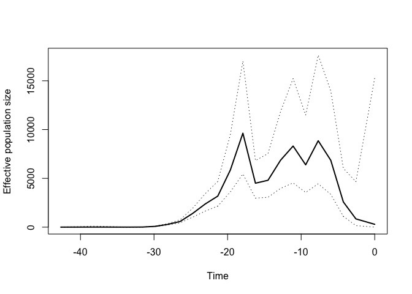
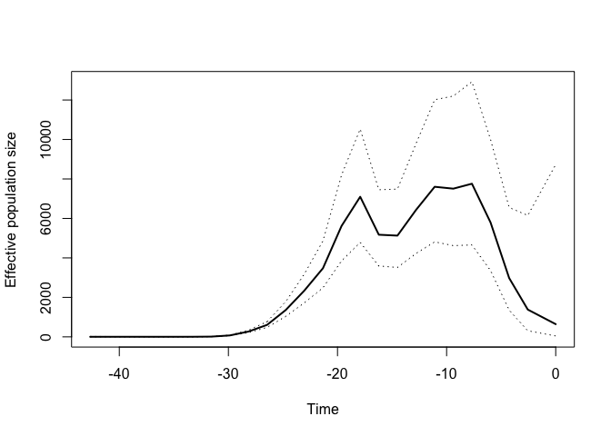
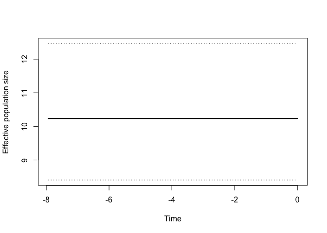

<!-- README.md is generated from README.Rmd. Please edit that file -->

# mlesky : Maximum likelihood inference of effective population size through time using GMRF-skygrid approach

This package is related to previous Bayesian implementations of the
Bayesian skygrid model with the following notable differences:

  - The GMRF process takes place on the 2nd-order difference of log(Ne),
    which is more similar to the `skygrowth` model of Volz & Didelot
  - When computing the GMRF likelihood, the smoothing parameter (ie the
    precision of random walk) is fixed
  - We use a novel cross-validation approach for selecting the smoothing
    parameter

## Installation

In R, install the `devtools` package and run

    devtools::install_github('emvolz-phylodynamics/mleksy')

## Roadmap

  - Add non-parametric bootstrap as alternative for CI
  - Add regression models for non-genetic time-series
  - Parameter to select order of differencing in GMRF

## HIV example

We analyzed 399 HIV-1 sequences from Senegal between 1990 and 2014. All
sequences are subtype CRF02\_AG. `treedater` analysis shows a common
ancestor around 1970 with LTT having rapid change in the early 1980s
when the HIV epidemic was expanding.

Here is the `mlesky` analysis

``` r
require(mlesky)
#> Loading required package: mlesky
treeHIV <- ape::read.tree( system.file('sn02ag2.0.nwk', package='mlesky') )
fit <- mlskygrid(treeHIV)
plot( fit, logy=FALSE)
```

<!-- -->

Now we use cross-validation to find the smoothing parameter:

``` r
fit <- mlskygrid(treeHIV, tau = NULL, tau_lower = 0.1, tau_upper = 20 , ncpu = 6)
#> Precision parameter *tau* not provided. Computing now....
#> Precision parameter tau =  7.45544756178241
plot(fit, logy=FALSE) 
```

<!-- -->

## Constant Ne(t)

Skyline, skyride and skygrid models have a tendency to erroneously
identify exponential growth in situations where the size is constant. We
can ameliorate that error by selecting a smaller time-axis resolution
and adapting the Ne time axis to periods where the phylogeny contains a
lot of information (default parameter `adapt_time_axis=TRUE`). This
shows the use of a function to optimize the `res` parameter (number of
Ne change points) using AIC

Simulate the tree with constant Ne:

``` r
library(ape)
set.seed(0)
tree=rcoal(100)
tree$edge.length=tree$edge.length*10#So that Ne(t)=10
plot(tree, show.tip.label = F)
axisPhylo(backward = T)
mtext("Years since sampling", side=1, line=3)
```

<!-- -->

Find the best `res`:

``` r
resx = optim_res_aic( tree , ncpu = 8,adapt_time_axis = T)
print(resx)
#> [1] 1
```

Note that this tests multiple `res` values and can quickened using
multi-core processing. The `ncpu` parameter should be chosen for your
system.

Estimate Ne(t):

``` r
fit <- mlskygrid( tree, res = resx, tau=NULL, tau_lower = 1,tau_upper = 10000,adapt_time_axis = T)
plot( fit , logy=FALSE)
```

<!-- -->
